**DISCLAIMER ON : Informasi yang dipaparkan dalam Newsletter ini bersifat sebagai referensi serta bahan pertimbangan, dan bukan merupakan perintah atau ajakan membeli maupun menjual saham terkait. Setiap keuntungan dan kerugian akan menjadi tanggung jawab dari masing-masing perilaku pasar.**

 

 

Infrastruktur merupakan salah satu faktor pendorong utama dalam meningkatkan produktivitas dan perekonomian dalam suatu negara. Infrastruktur yang baik ini akan membantu pemerataan ekonomi, pemerataan pembangunan, serta meningkatkan kesejahteraan masyarakat dalam suatu negara. Oleh karena itu, pembangunan infrastruktur ini menjadi salah satu fokus program kerja Bapak Presiden Joko Widodo yang pertama hingga yang kedua dengan tujuan untuk mempercepat pembangunan infrastruktur untuk dapat menghubungkan kawasan produksi dan distribusi, mempermudah akses ke kawasan wisata, serta mendongkrak lapangan kerja di Indonesia. Oleh karena itu, anggaran infrastruktur Indonesia mengalami peningkatan dari tahun ke tahun. Berikut merupakan anggaran infrastruktur Indonesia:

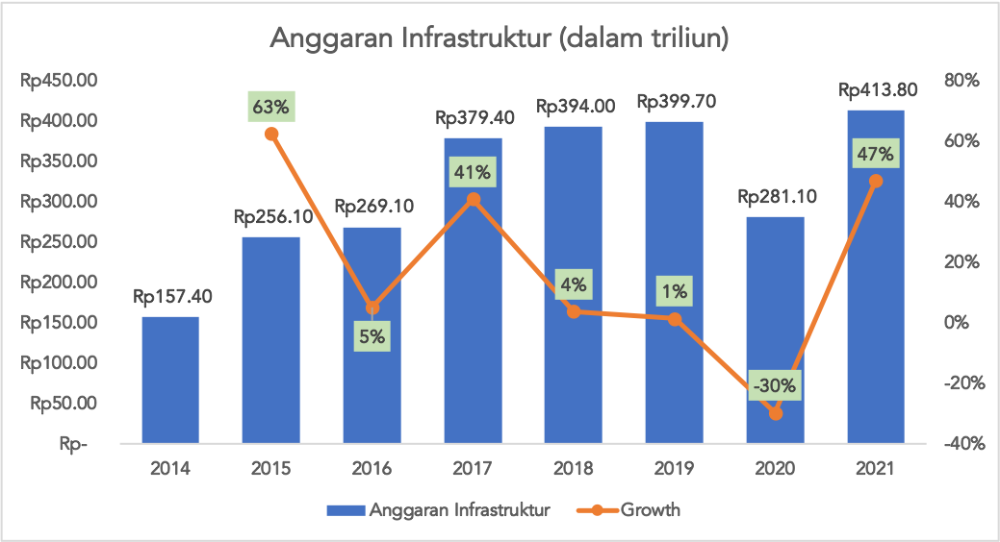

Penurunan anggaran infrastruktur dalam tahun 2020 diakibatkan anggaran infrastruktur dialokasikan untuk penanganan pandemi COVID-19 di Indonesia. Selain anggaran infrastruktur ini, pemerintah Indonesia akan mengeluarkan Sovereign Wealth Fund (SWF) yang diberi nama Nusantara Investment Authority (NIA). NIA ini akan dikelola oleh Lembaga Pengelola Investasi (LPI). Singkatnya, SWF ini seperti perusahaan venture capital yang akan fokus untuk mendanai infrastruktur tol, seaport, dan airport. NIA ini dikabarkan memiliki target US$20 miliar atau setara dengan Rp280,64 triliun (kurs Rp14.032). Hal ini memberikan sentimen positif bagi perusahaan infrastruktur dan konstruksi di Indonesia. Adanya dana NIA dan anggaran infrastruktur yang tinggi ini akan sangat menguntungkan perusahaan infrastruktur dan konstruksi. Oleh karena itu, perusahaan yang diuntungkan harus siap secara operasional dan kuat secara finansialnya.

Untuk kali ini, saya akan membahas mengenai perusahaan yang saya investasikan. PT Pembangunan Perumahan (Persero), Tbk merupakan salah satu perusahaan BUMN yang bergerak dalam bidang perencanaan dan konstruksi bangunan yang sudah berdiri sejak 26 Agustus 1953. PTPP sudah melantai di lantai Bursa Efek Indonesia (BEI) pada 9 Februari 2010 dengan kode emiten PTPP dengan menjual 21,49% kepemilikannya kepada publik. Saat ini, perusahaan PTPP ini memiliki beberapa bidang bisnis, antara lain energi, precast, real estate (developer), dan properti. Untuk saat ini, Bapak Ir. Novel Arsyad, MM memegang jabatan sebagai direktur utama. Mari kita analisis kinerja keuangan PTPP selama 7 tahun kebelakang. Berikut merupakan *revenue* breakdown per lini usaha:

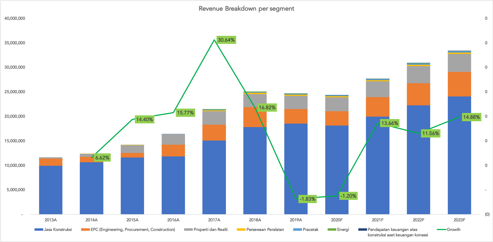

Berikut merupakan proporsi dari setiap lini bisnis yang ada:

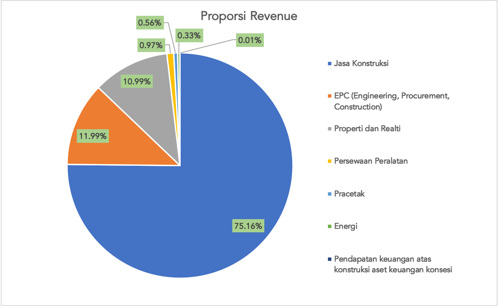

Jasa konstruksi, EPC, dan properti merupakan salah satu penyumbang revenue terbesar bagi perusahaan PTPP. Jika kita proyeksikan karena adanya NIA dan infrastruktur menjadi salah satu fokus program kerja era kepemimpinan Bapak Presiden Joko Widodo, maka dapat dipastikan pendapatan perusahaan pun akan semakin meningkat untuk tahun mendatang. Salah satu penyebab menurunnya pendapatan perusahaan disebabkan oleh menurunnya nilai kontrak baru perusahaan yang diperoleh pada tahun 2019. Selain itu, perolehan nilai kontrak baru perusahaan pun mengalami tren yang menurun dari tahun 2015 - 2019. Berikut merupakan nilai kontrak baru yang berhasil diterima oleh perusahaan:

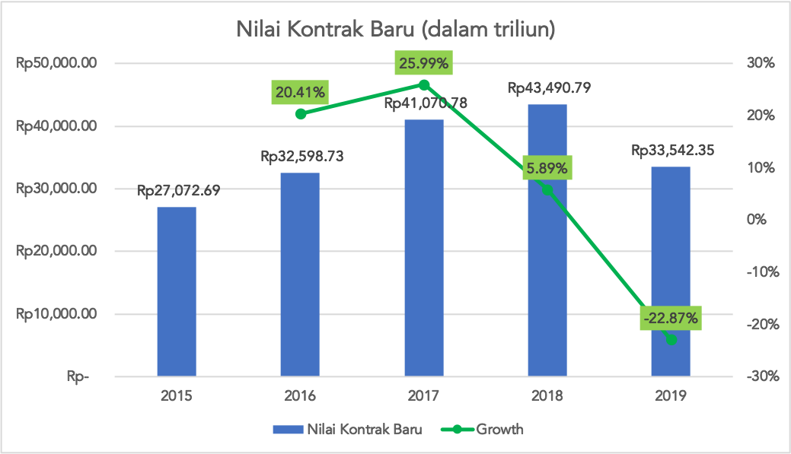

Perusahaan masih profitable dalam 7 tahun terakhir. Namun, kinerja keuangan perusahaan dalam tahun 2019 mengalami penurunan dikarenakan menurunnya pendapatan perusahaan sebesar 1,82% jika dibandingkan pada tahun 2019. Selain itu, terdapat beban-beban yang meningkat seperti penurunan aset proyek konsensi, minyak dan gas bumi, dan nilai persediaan. Beban keuangan pun meningkat 2,94% pada tahun 2019. Hal ini yang membuat net income perusahaan menurun sebesar 38,06% di tahun 2019. Penurunan *net income* ini membuat earning per share (EPS) perusahaan menurun 62% dari Rp242/lembar menjadi Rp150/lembar. Berikut *net income* yang berhasil dicetak oleh perusahaan dari tahun 2013 hingga tahun 2019:

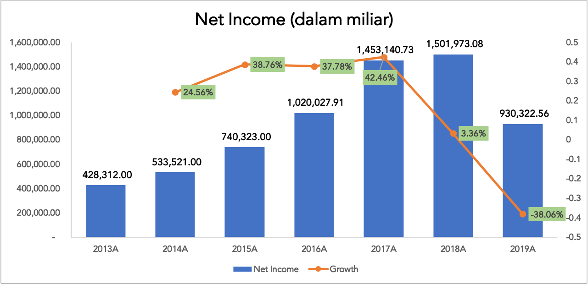

## Analisis Rasio Keuangan

### Rasio Likuiditas

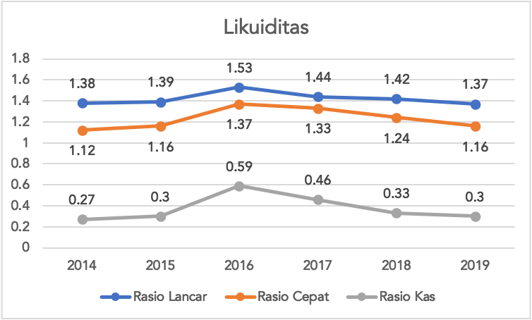

Rasio likuiditas perusahaan masih ada di batas yang aman karena rasio lancar dan rasio cepat yang masih di atas satu. Untuk aset paling lancarnya sendiri dapat diketahui mampu menutup seluruh kewajiban lancarnya. Hal ini meminimalisir kemungkinan perusahaan terkena financial distress. 

### Rasio Aktivitas

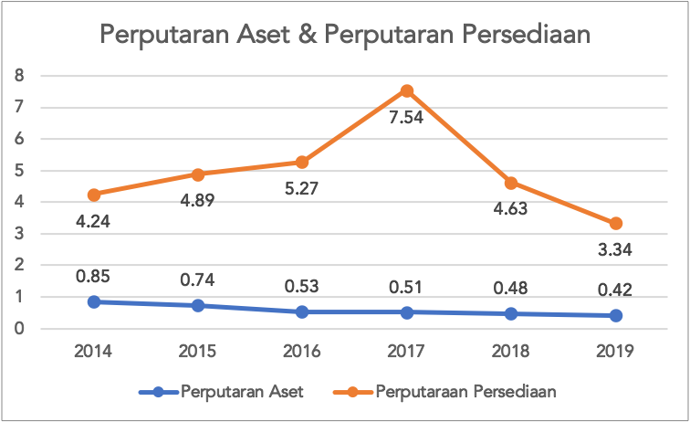

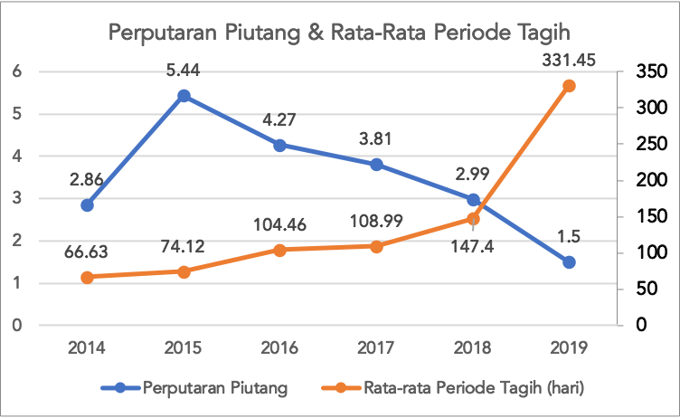

Berdasarkan dari rasio aktivitas perusahaan, dapat diketahui bahwa perusahaan memiliki tren yang menurun dari tahun 2014 - 2019 ini. Manajemen aset dan piutang perusahaan semakin menurun terutama di tahun 2019. Manajemen piutang perusahaan semakin menurun dikarenakan adanya penurunan pendapatan perusahaan pada tahun 2019.

### Rasio Profitabilitas

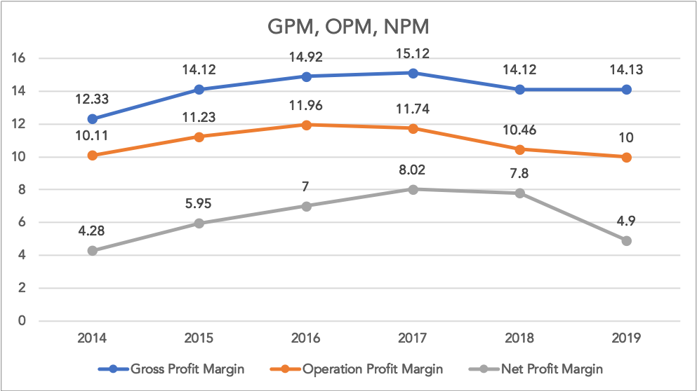
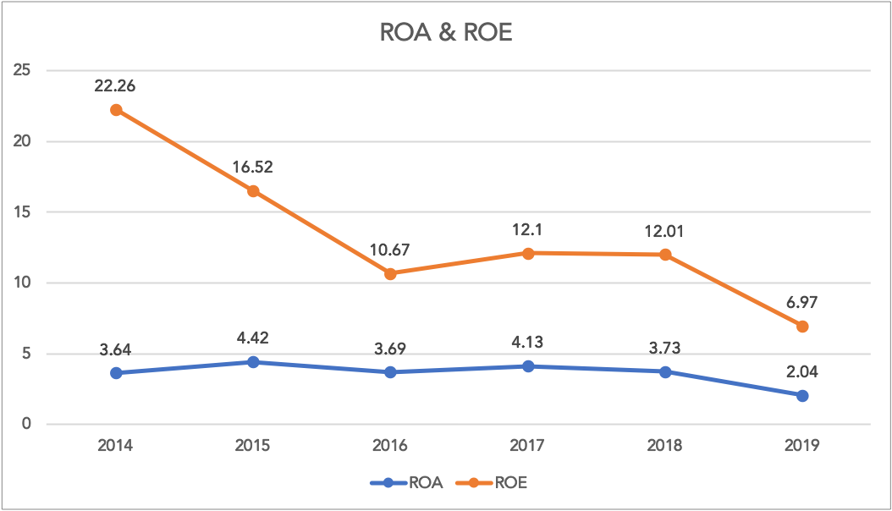

Dari rasio profitabilitas, perusahaan masih profitable dalam tahun 2015 - 2019. Tapi, rasio profitabilitas perusahaan mengalami penurunan di tahun 2019 dikarenakan pandemi COVID-19 ini yang membuat hampir seluruh sektor usaha di Indonesia menurun, terutama sektor infrastruktur itu sendiri. Penurunan ini masih dapat dikatakan wajar karena hampir seluruh perusahaan yang ada mengalami penurunan juga karena pandemi COVID-19. Namun, seiring dengan berjalannya waktu, dipercaya bahwa performa PTPP ini akan meningkat kembali di tahun 2021 ini.

### Rasio Solvabilitas

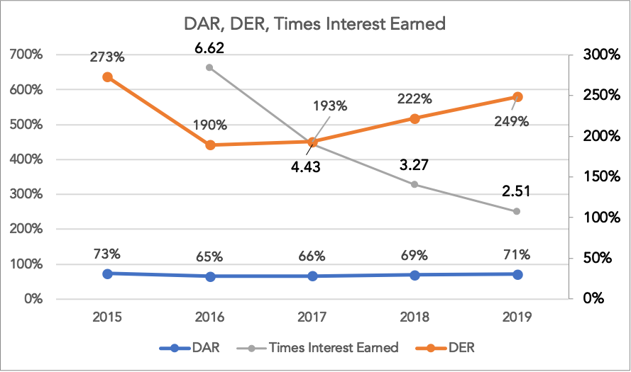

Dari rasio solvabilitasnya sendiri, dapat diketahui bahwa perusahaan memiliki utang yang cukup besar dikarenakan modal untuk membangun proyek infrastruktur Indonesia ini besar dan hal ini pun masih wajar karena DER konstruksi itu berada di 3x - 4x. Namun yang perlu diperhatikan bahwa kemampuan perusahaan dalam membayar beban bunga pinjaman semakin menurun. Hal ini pun diakibatkan karena penurunan pendapatan yang diperoleh tahun 2019 yang mengakibatkan EBIT (Earning Before Income and Tax) perusahaan menurun juga. Beban keuangan perusahaan pun meningkat karena perusahaan menambah utangnya sebagai modal pembangunan proyek yang akan dikerjakannya.

## Valuasi

Nah, mari kita lihat dari valuasi sahamnya sendiri. Untuk kali ini, saya akan menggunakan relative valuation. Mari kita hitung untuk Price Earning Ratio (PER) dari PTPP itu sendiri:

Nah, dikasus kali ini, nilai PER PTPP sangat tinggi dikarenakan EPS yang sangat kecil, yaitu Rp6,00 saja. Hal ini karena adanya pandemi COVID-19 di Indonesia yang membuat net income perusahaan kecil. Tim Anderson Research sudah memproyeksi pendapatan perusahaan untuk tahun-tahun mendatang. Berikut merupakan proyeksinya:

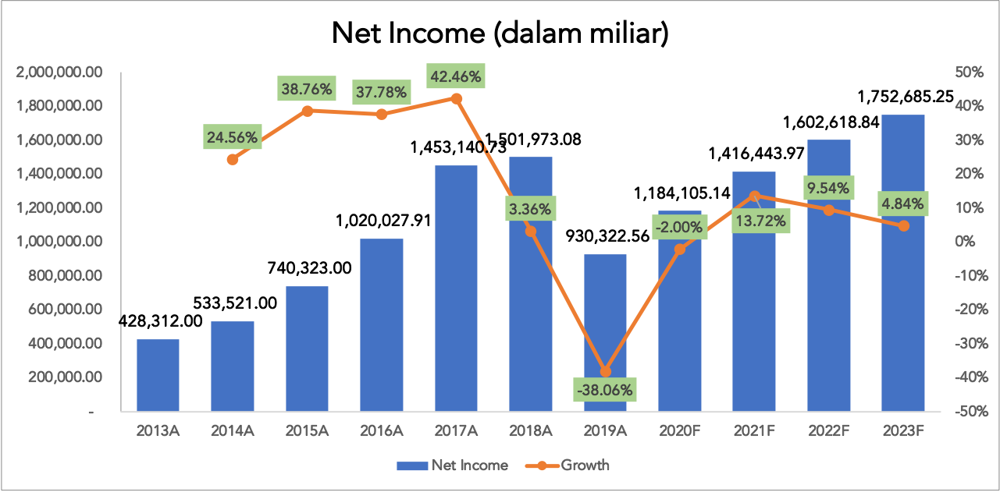

Jika kita hitung EPS untuk tahun 2021 ini, kita akan mendapatkan nilai PER sebagai berikut:

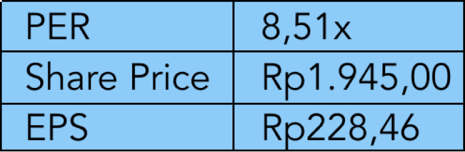

Price to Earning Ratio (PER) sebesar 8,51x ini dapat dikatakan bahwa harga saham saat ini (Rp1.945) dihargai 8,5x dibandingkan dengan earnings pada tahun 2019. Berikut merupakan benchmarking dari segi PER dan PBV:

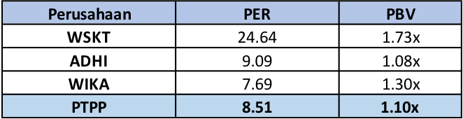

Jika lihat tabel di atas, dapat dilihat bahwa PER perusahaan masih berada dalam 2 peringkat termurah dibandingkan dengan pesaingnya. PBV pun menunjukkan bahwa perusahaan masih kedua termurah dibandingkan dengan perusahaan lainnya.

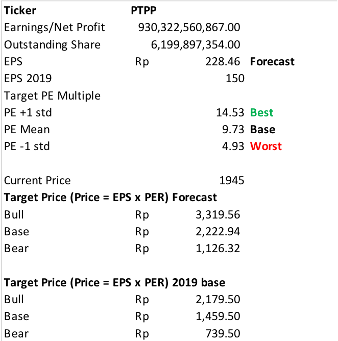

Kalau kita simpulkan, maka target price atau nilai intrinsiknya jika kita menggunakan EPS forecast adalah Rp2.222,94. Maka dari itu, dari analisis PERnya dapat kita simpulkan, kita masih dapat membeli saham PTPP ini. Jika kita lihat dari PBVnya, berdasarkan data dari RTI, saat ini perusahaan memiliki PBV sebesar 1,10x. PBV masih bisa ditoleransi karena dapat dianggap murah. Lalu akan timbul pertanyaan, kapan sih waktu yang tepat untuk masuk ke saham ini? Nah, saya sudah membuat plan kapan masuk dan kapan untuk take profit bagi kawan-kawan yang ingin investasi jangka pendek atau menengah. Berikut plan yang sudah dibuat tim Anderson Research:

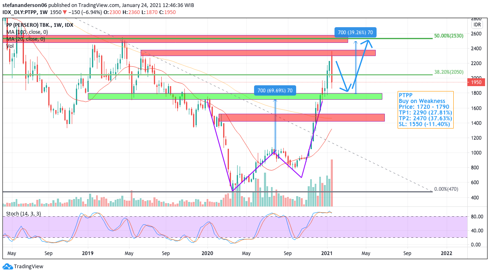

Kita dapat masuk saat harga menyentuh garis hijau di level 1720-1790, namun jika kita ingin membelinya sekarang masih boleh karena cenderung dalam range harga yang murah. Diharapkan jika harga menyentuh garis hijau ini, harga akan kembali menguat dan diperkirakan dapat menguat ke level 2290 (garis merah yang pertama) dan jika harga masih menguat, maka akan naik ke level 2470.

## Kesimpulan

Kinerja keuangan PTPP mengalami penurun di tahun 2019 dan dipercaya akan mengalami penurunan kembali di tahun 2020 dikarenakan adanya pandemi COVID-19. Namun, sejauh ini perusahaan masih mampu untuk mencetak labanya berdasarkan laporan keuangan kuartal 1 hingga 3. Hal ini menunjukkan bahwa manajemen perusahaan bekerja sangat baik dalam bertahan di tengah pandemi COVID-19 ini. Perusahaan akan semakin kuat karena didukung dari adanya NIA (SWF Indonesia) dan infrastruktur sebagai salah satu fokus program kerja pemerintah. Saham PTPP pun layak dikumpulkan karena harganya yang masih tergolong murah. Jangan lupa untuk selalu membuat plan masing-masing agar hasil investasi lebih maksimal!

Anda bisa mendapatkan akses untuk mendownload ke newsletter saya mengenai research PTPP di link ini: http://bit.ly/AndersonNewsletter .

Semoga bermanfaat! Be a smart investor!

Thanks to : C. Dustin (unsplash.com) for the amazing photo!