**Research Team: Jeremy Owen & Stefan Manuel Anderson**

##### DISCLAIMER ON : Informasi yang dipaparkan dalam artikel ini bersifat sebagai referensi serta bahan pertimbangan, dan bukan merupakan perintah atau ajakan membeli maupun menjual saham terkait. Setiap keuntungan dan kerugian akan menjadi tanggung jawab dari masing-masing pelaku pasar.

# Sekilas tentang BISI Internasional Tbk.

PT BISI Internasional Tbk. merupakan science-based multinational company yang memproduksi produk-produk pertanian. Perseroan berdiri pada tanggal 22 Juni 1983 dan melantai di Bursa Efek Indonesia (BEI) pada tanggal 28 Mei 2007. BISI merupakan produsen hybrid seeds jagung, padi, dan horticulture terbesar di Indonesia dan untuk lebih menunjang kinerja perusahaan, BISI juga memiliki lini bisnis lain yaitu bisnis pestisida dan pupuk.

# Pemegang Saham Perusahaan

Perusahaan ini dimiliki oleh keluarga Jiaravanon lewat beberapa perusahaan luar negeri seperti SJ BISI Holdings Pte. Ltd., Field Investment Holdings Pte. Ltd., Valley Investment Holdings Pte. Ltd., Vista Investment Holdings Pte. Ltd., dan juga dari perusahaan dalam negeri yaitu PT Agrindo Pratama yang dimiliki 100% lewat Great Emerald Pte. Ltd yang juga 100% dimiliki oleh Keluarga Jiaravanon. Perlu diketahui bahwa Keluarga Jiaravanon juga pemilik dan pemegang saham dari Charoen Pokphand Group, perusahaan swasta terbesar di Thailand. Keluarga Jiaravanon dinobatkan sebagai keluarga terkaya nomor 3 di Asia pada tahun 2020 menurut Bloomberg (https://www.bloomberg.com/features/2020-asia-richest-families/) dan Dhanin Jiaravanon adalah orang terkaya nomor 81 dunia menurut Forbes Billionaire’s List 2020 (https://www.forbes.com/billionaires/). Selain menjadi market leader dalam bidang pertanian lewat PT BISI International Tbk di Indonesia, Keluarga Jiaravanon juga menguasai bidang poultry yang terintegrasi lewat PT Charoen Pokphand Indonesia Tbk yang juga perusahaan terbesar di bidangnya. Singkatnya, BISI disokong oleh pemegang saham yang sangat kuat, berpengaruh dan berpengalaman dibidangnya. Sebagai gambaran, berikut adalah struktur pemegang saham perseroan:

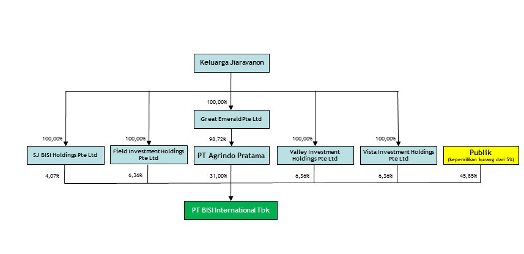

# Manajemen

Direktur Utama BISI adalah Jemmy Eka Putra yang mendapatkan gelar sarjana bidang pertanian pada tahun 1990 dan memulai karir di BISI pada tahun yang sama. Diangkat menjadi direktur utama pada tahun 2009. Agus Saputra Wijaya bergelar sarjana ekonomi dan memulai karir di Charoen Pokphand Group Indonesia pada 2003 dan diangkat menjadi direktur keuangan ad-interim dan direktur produksi II BISI pada tahun 2019. Putu Darsana bergelar doktor bidang Agronomi dari Kasetart University, Bangkok, diangkat menjadi direktur pada tahun 2006 sebagai direktur riset dan pengembangan. Joseph Suprijanto juga merupakan lulusan agronomi, memulai karir di BISI pada 1988 dan diangkat menjadi direktur pemasaran pada 2011. Triono Hardyanto menyelesaikan pendidikan di fakultas pertanian, memulai karir di BISI pada 2005 dan diangkat menjadi direktur produksi I pada tahun 2014. Arief Tonny Kusuma menyelesaikan studi bidang akuntansi, memiliki pengalaman kerja impresif di PT Central Proteinprima Tbk, PT Satwa Utama Raya  dan PT Semesta Mitra Sejahtera sebelum bergabung menjadi direktur BISI pada tahun 2020.

Jajaran komisaris dimulai dengan Tjiu Thomas Effendy yang memperoleh gelar master bidang administrasi bisnis di Filipina pada tahun 1994. Memulai karir di BISI pada tahun 1980 dan diangkat menjadi komisaris utama pada tahun 2009. Beliau juga menjabat sebagai presiden direktur PT Charoen Pokphand Indonesia Tbk. Ong Mei Sian yang mengambil jurusan business administration Universitas Parahyangan. Memulai karir di PT Charoen Pokphand Indonesia Tbk pada 1993, menjadi direktur PT Charoen Pokphand Indonesia Tbk pada tahun 2008 dan diangkat menjadi komisaris BISI pada tahun 2016. Burhan Hidayat menyelesaikan studi bidang akuntansi, bekerja di PT Charoen Pokphand Indonesia Tbk dari tahun 1978 hingga 2005 lalu menjabat sebagai komisaris independen BISI pada tahun 2019 juga menjabat sebagai ketua komite audit BISI hingga tahun 2023.

BISI menggunakan prinsip ***putting the right man on the right place on the right time***. Direksi dan komisaris memiliki latar belakang pertanian, agronomi dan manajemen. Mayoritas Direksi dan komisaris juga sudah bekerja untuk waktu yang cukup lama dengan pengalaman yang cukup banyak serta diangkat menjadi direksi dan komisaris ketika sudah menunjukan performa dan loyalitas yang baik kepada perseroan. Hal ini menarik bagi pemegang saham karena perusahaan dinakhodai dengan orang yang kompeten dan dikelola dengan orang-orang yang capable dibidangnya masing-masing. Laporan tahunan 2019 menunjukan absensi rapat rutin jajaran direksi dan dewan komisaris. Dari daftar yang kami temukan, seluruh direksi dan komisaris tidak pernah sekalipun absen dalam menghadiri rapat rutin kecuali Arief Tonny Kusuma karena belum menjadi bagian dari perusahaan dan Agus Saputra Wijaya hanya menghadiri setengah dari rapat rutin yang ada karena baru diangkat menjadi direksi pada pertengahan 2019. Kami juga menelusuri jejak direksi maupun komisaris dan tidak ditemukan adanya kasus yang menyangkut masalah tanggung jawab dan integritas jajaran direksi dan komisaris.

# Kegiatan Usaha

Berikut adalah kegiatan usaha yang dijalankan oleh BISI saat ini:

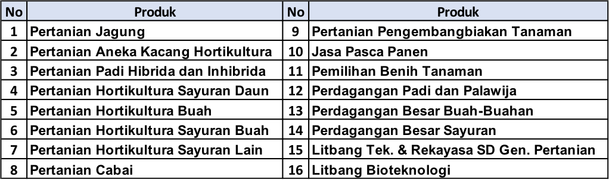

Untuk pertanian dan pembibitan, BISI menggabungkan cara konvensional dengan biotechnology untuk menghasilkan bibit yang akan dijual kepada pengguna. Hal ini terbukti membuat kualitas tanaman menjadi lebih sehat, kebal terhadap hama, cepat tumbuh, dan lebih produktif. Hal ini tercapai karena BISI memiliki periset sebanyak 104 orang (7 gelar doktor dan 15 gelar master), investasi yang cukup besar untuk riset yaitu sebesar Rp 70 miliar setiap tahun dan kolaborasi dengan beberapa perusahaan atau institusi di negara-negara lain, antara lain:

1. Monsanto Company, US dan Chia Tai Seed Co. Ltd., Thailand untuk pengembangan produk benih jagung hibrida serta benih buah dan sayuran. 
2. Sanonda International, China untuk mengembangkan pupuk dan pestisida.
Perseroan juga bekerja sama dengan Badan Penelitian dan Pengembangan Pertanian Indonesia dalam pengembangan, produksi dan pemasaran beberapa jenis benih unggulan merek BISI. 

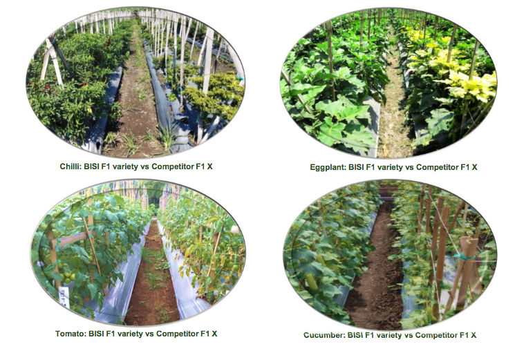

Philip Fisher dalam Common Stocks and Uncommon Profit berkata bahwa perusahaan yang berbasis sains dan teknologi harus berkomitmen dalam hal riset dan pengembangan agar tetap kompetitif jika dibandingkan dengan pesaing, tetap relevan serta mampu mempertahankan pangsa pasarnya. Komitmen BISI dalam riset dan pengembangan bisa dilihat dari usaha kolaborasi dengan perusahaan luar negeri, dengan pemerintah dan juga investasi per tahun sebesar Rp 70 miliar yang merupakan 58% dari *capital expenditure* perusahaan. 

BISI memiliki *Contract Farming Program* yang bertujuan untuk membimbing dan melatih para petani lokal meningkatkan kualitas hasil produksi. BISI sendiri akan menyediakan benih yang dibutuhkan oleh para petani dan membeli hasil panen dari petani tersebut. Tahun 2014, program ini menjangkau 40.148 petani dan 11.025 hektar lahan. Tahun 2019, program ini menjangkau 140.066 petani dan total area lahan sebesar 34.739 hektar. Target berikutnya dari perseroan yaitu berkembang dan menjangkau 100.000 hektar atau bertumbuh sekitar 3x lipat lagi dari kondisi hari ini.

BISI memiliki website dan aplikasi smartphone untuk menjual dan memasarkan produknya, yaitu BISI Sahabat Petani. Platform BISI ini memiliki katalog produk dan teknologi budidaya, forum konsultasi, testimoni para petani, belanja produk BISI dari toko terdekat, serta menyediakan harga komoditi dan ramalan cuaca. Selain itu, BISI menjalankan 2 strategi baru yaitu agresif menyalurkan distribusi produk pada end retailer, maka armada yang digunakan dari 2019 hanya 6 mobil, tahun 2020 menjadi 46 mobil dan 2021 diharapkan tumbuh menjadi 150 kendaraan untuk mempercepat dan memperluas distribusi merek BISI. 

Strategi berikutnya adalah menggalakan program urban farming dimana para konsumen bisa langsung membeli benih-benih tanaman dan tumbuhan untuk ditanam dirumah semasa pandemi. Konsep yang ditawarkan menarik karena murah dan tidak memakan banyak tempat di rumah konsumen. Pada Juni 2020, BISI sudah berhasil menjual 61.000 pack benih per bulan dan menargetkan 100.000 pack per bulan lewat Tokopedia, Bukalapak, Shopee dan Prima Freshmart Outlet.

# Performance Highlight 2019

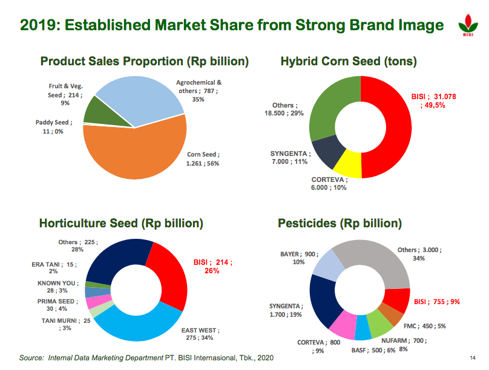

Berdasarkan data diatas, benih jagung memiliki market share terbesar dibandingkan dengan 49,5% dan menyumbang pendapatan terbesar bagi perseroan sebesar 56% dari total penghasilan, tidak heran BISI memiliki economic moat yang cukup tinggi dilihat dari Gross Profit Margin sebesar 39%. Untuk benih horticulture, BISI memiliki market share sebesar 26% (kedua terbesar) dan pestisida meraih 9% (ketiga terbesar). BISI sendiri memiliki target untuk meningkatkan penjualan pestisidanya sebesar 28% di tahun yang akan datang. Hal menjadi perhatian bagi kami adalah kecilnya kontribusi dari benih padi perseroan. 

Memang kami temukan bahwa perseroan baru menjalankan bisnis benih padi pada 2015 dan sempat meningkat hingga tahun 2017, namun sejak itu mengalami penurunan karena faktor cuaca. Namun, jika kondisi iklim lebih bersahabat, teknologi produksi BISI yang akan mengurangi biaya produksi serta promosi penggunaan benih padi hibrida berhasil, seharusnya bisnis benih padi mampu bertumbuh double digit sekarang hingga 3 tahun mendatang. Luas sawah di Indonesia adalah 15 juta hektar atau 3-4x lipat luas ladang jagung. Total nilai pasar benih padi nasional sekitar USD 712.5 juta dan USD 512.5 juta merupakan kontribusi dari benih hibrida. 

Jika kami hubungkan fakta yang ada di lapangan dengan kebijakan pemerintah yang akan menggalakan program ketahanan pangan, maka sentimen untuk BISI kami rasa cukup positif dan memiliki prospek sangat baik. Tentu pandangan kami perlu dibuktikan dengan berjalan atau tidaknya program ketahanan pangan dari pemerintah dan perlu evaluasi apakah produksi benih padi hibrida dan kontribusinya terhadap pendapatan perseroan akan meningkat atau tidak pada tahun 2021 dan seterusnya.

Tahun 2019 menjadi tahun yang buruk karena anomali cuaca sehingga mengganggu hasil panen serta peningkatan biaya yang mempengaruhi kinerja perseroan. Peningkatan biaya sebesar 14.1% terjadi untuk memproduksi bibit jagung dan horticulture hibrida sehingga menggerus margin perusahaan. Tahun 2020, BMKG menyatakan tidak ada anomali cuaca seperti 2019, maka performa perseroan pun membaik meskipun menghadapi pandemi. Jika melihat 9M 2019 dan 9M 2020, terlihat bahwa ada pertumbuhan yang cukup signifikan bagi perseroan. Untuk mengatasi dan antisipasi masalah cuaca dan iklim, BISI melakukan pengembangan agar benih hibrida yang dihasilkan dapat lebih bertahan terhadap kondisi cuaca dan iklim yang kurang mendukung agar para petani tetap mampu untuk panen dengan hasil yang memuaskan.

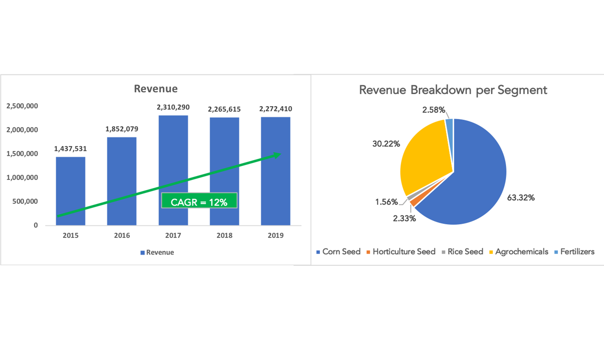

Perusahaan memiliki target peningkatan revenue sebesar 10% dalam penjualan bibit horticultural-nya. Selain bibit horticultural, terjadi peningkatan nilai olahan pertanian yang cukup tinggi dari Januari - Agustus 2020 yang mencapai nilai USD15,92 miliar. Nilai ini naik 5,4% dibandingkan periode 2019 yang sebesar USD15,09 miliar. Peningkatan nilai olahan pertanian ini berdampak positif pada peningkatan Nilai Tukar Petani (NTP) pada tahun 2020 sebesar 0,56% (dari 100,09 menjadi 100,65). NTP adalah alat ukur untuk mengukur kemampuan tukar produk yang dijual petani dengan produk yang dibutuhkan petani dalam produksi dan konsumsi rumah tangga. Jika kita lihat lebih dalam lagi, tanaman pangan (salah satunya gabah dan jagung) memiliki bobot terbesar bagi NTP sebesar 47,37%. Dari 47,37% ini, gabah menguasai sebesar 75,44% dan jagung sebesar 13,95%. Hal ini dipercaya akan meningkatkan revenue perusahaan di tahun 2020. 

Kami memprediksi bahwa revenue pada tahun 2020 ini sebesar Rp2.564.452 miliar dengan menggunakan skenario yang lebih konservatif agar resiko miskalkulasi bisa berkurang. 

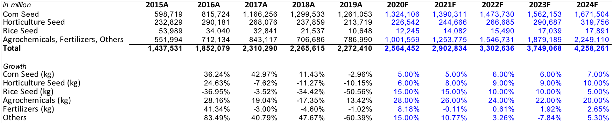

BISI berhasil meningkatkan laba bersihnya dari tahun 2015 hingga tahun 2018. Di tahun 2019, laba bersih BISI menurun dikarenakan beberapa faktor, yaitu:

1. Biaya produksi perusahaan meningkat dikarenakan iklim anomali pada tahun 2019.

2. Perusahaan menambah utang bank jangka pendeknya sebesar Rp855.000 juta yang digunakan untuk modal pembelian bahan baku dan sebagai tambahan modal kerja. Hal ini menyebabkan bunga keuangan (bunga pinjaman) meningkat cukup signifikan.

3. Ada Rp9.481 juta piutang yang tidak tertagih di tahun 2019.

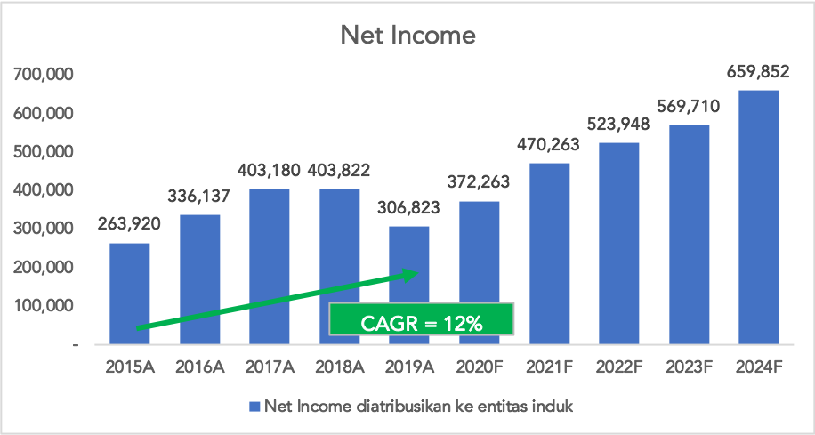

Dari hasil analisis rasio yang sudah dilakukan, dapat diketahui bahwa:

1. Perusahaan memiliki tingkat likuiditas yang tinggi dikarenakan tingkat utang jangka pendek maupun jangka panjang yang sangat sedikit. Hal ini terbukti saat perusahaan menambah utangnya, maka utang tersebut langsung dibayarkan oleh pihak perusahaan.
2. Perusahaan memiliki tingkat *Debt to Equity Ratio* dan *Debt to Asset* Ratio yang sangat kecil sehingga perusahaan tidak perlu banyak hutangnya untuk menjalankan kegiatan operasionalnya. Kemampuan perusahaan dalam membayar bunga pinjaman pun sangat tinggi.
3. Perusahaan memiliki tingkat ROE sebesar 13,24% di tahun 2019 serta memberikan ROE-nya diatas 10% selama 5 tahun terakhir. Namun 2019 mengalami penurunan karena alasan yang sudah kami jelaskan sebelumnya.
4. GPM yang konsisten diatas 30% membuktikan BISI memiliki economic moat yang cukup tinggi dibanding kompetitornya.

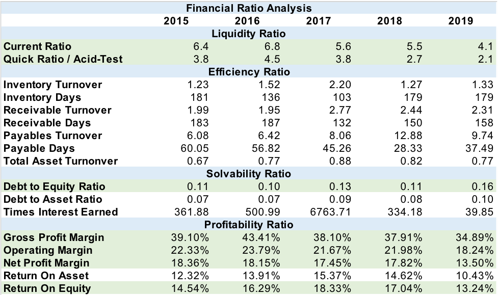

# Dividen

Hal yang perlu diperhatikan bagi investor adalah pembagian dividen. Sejak tahun 2011, perusahaan selalu membayarkan dividennya kepada pemegang sahamnya. Konsistensi dalam membagikan saham juga dapat kami anggap sebagai tolak ukur kinerja manajemen. Dengan pembagian yang rutin, kami semakin yakin bahwa BISI memiliki manajemen yang baik. Berikut merupakan riwayat pembagian dividen perusahaan:

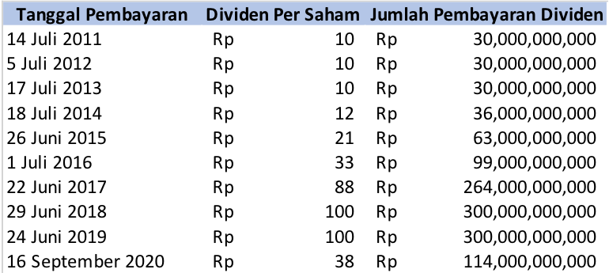

# Arus Kas

Arus kas perusahaan memberikan positif selama 5 tahun terakhir kecuali arus kas operasi di tahun 2018 yang negatif dikarenakan adanya peningkatan pembayaran pada supplier. Hal ini diiringi dengan menambahnya inventory perusahaan di tahun 2018 sebesar 75,35% dikarenakan kenaikan benih jagung (barang dalam proses). Kenaikan tersebut untuk memenuhi permintaan pasar atas benih jagung. Jadi, arus kas operasi negatif di tahun 2018 masih dapat dikatakan wajar karena diiringi dengan peningkatan persediaan yang cukup signifikan

# Valuasi

### Discounted Cash Flow (DCF)
Berdasarkan perhitungan dari model DCF, harga wajar saham sebesar Rp1.418. Maka dari itu, harga saham saat ini Rp1.130 (1 Februari 2021) dapat dikatakan masih  ***undervalue*** meskipun perlu diingat perlu ditambahkan ***margin of safety*** agar investor lebih aman dari resiko penurunan harga.

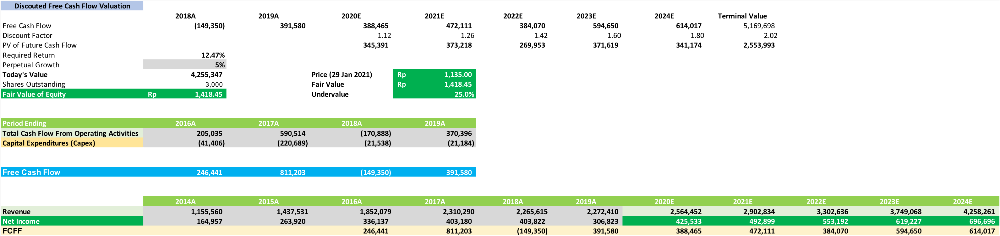

### PER Valuation
Kami memiliki 3 asumsi perhitungan PER. Asumsi pertama, kami menggunakan EPS 2020 Annum. dari kuartal satu hingga 3. Asumsi kedua, kami menggunakan EPS 2019. Asumsi ketiga, kami menggunakan EPS 2020 *Forecast*. Jika mengambil rata-rata dari 3 asumsi tersebut, didapatkan harga wajar sebesar Rp1.297,91. Namun, kami tidak mengambil harga wajar tersebut dikarenakan EPS 2020 Annum. yang sangat kecil. Kami yakin kinerja bisnis BISI di kuartal 4 ini akan memberikan performa yang baik. Maka dari itu, kami beranggapan harga wajar BISI ini di sekitar **Rp1.300 - Rp1.400**.

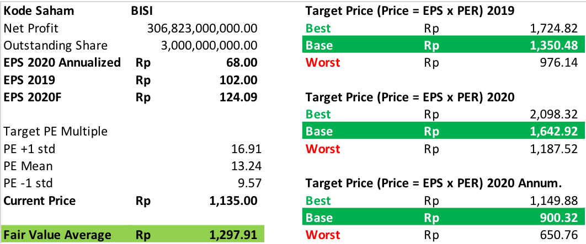

### PBV Valuation

Berdasarkan PBV, harga saham dihargai 1,25x dari nilai bukunya. Harga saham saat ini Rp1.135 lebih mahal daripada nilai buku meskipun jika dilihat lebih rinci, perseroan memang selalu dihargai diatas nilai bukunya. Tiga tahun terakhir rata-rata PBV perseroan sebesar 1.79 dengan harga Rp 1.625 dan 5 tahun terakhir sebesar 2.13 dengan harga Rp 1.934

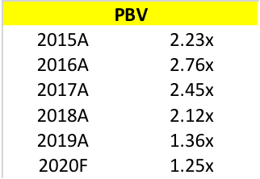

### Enterpirse Value per EBITDA (EV/EBITDA)
Berdasarkan perhitungan EV/EBITDA, maka dapat diketahui bahwa valuasi BISI lebih rendah daripada pesaingnya dalam industri yang mirip (tidak ada kompetitor langsung BISI yang terdaftar di BEI).

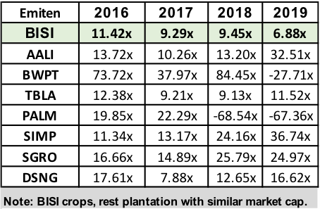

# Prospek

Dilansir dari Investor.ID yang ditulis oleh Abdul Aziz dan Primus Dorimulu, Frank Widjaja (Wakil Ketua Umum Kadin Indonesia Bidang Agribisnis, Pangan, dan Kehutanan) menegaskan bahwa Indonesia bisa menjadi salah satu pemain penting dalam kancah perekonomian global. Untuk dapat mewujudkannya, maka Indonesia harus mulai menggenjot industri unggulan, salah satunya ialah agribisnis, pangan, dan industri pengolahannya. Adanya iklim yang mendukung, benih yang semakin tahan akan perubahan cuaca & iklim, serta peningkatan penduduk akan meningkatkan kebutuhan akan padi, jagung, serta tanaman hortikultura milik perseroan. Beberapa rincian sentimen positif bagi perseroan adalah:

#### Anggaran ketahanan pangan yang meningkat.

Anggaran ketahanan pangan memiliki tren yang menurun dari tahun 2016 hingga 2020, namun di tahun 2021 ini, pemerintah menambahkan anggaran ketahanan pangan menjadi Rp 104T dengan tujuan untuk meningkatkan produksi pangan di Indonesia khususnya padi, jagung dan kedelai, mendukung pemulihan ekonomi, dan membuka lapangan kerja baru bagi masyarakat. Ketahanan pangan juga dapat mendorong produksi komoditas pangan, revitalisasi sistem pangan nasional, dan pengembangan food estate atau lumbung pangan baru di Kalimantan Tengah, Sumatera utara, dan Papua. Food estate merupakan konsep pengembangan pangan yang dilakukan secara terintegrasi mencakup pertanian, perkebunan, bahkan peternakan di suatu kawasan. 

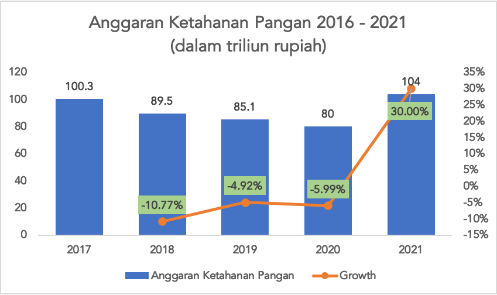

#### Peningkatan penduduk yang membuat kebutuhan pangan meningkat.

Berdasarkan data dari BPS dan Bappenas, penduduk Indonesia akan meningkat 9,09% di tahun 2030 dari 269,20 juta jiwa di tahun 2020 menjadi 294,11 juta jiwa di tahun 2030. Ditambah lagi dengan riset dari NDESA 2017, World Population Prospect, FAO 2017 yang menyatakan bahwa penduduk Indonesia akan terus meningkat menjadi 345 juta penduduk pada tahun 2030. Hal ini akan berdampak pada peningkatan sebesar 40% akan kebutuhan pangan terutama beras, jagung dan kedelai.

#### Penggunaan bioteknologi, digitalisasi dan kolaborasi 

BISI terus melakukan pengembangan terhadap produknya dengan membuat varietas-varietas baru dengan bantuan bioteknologi dan kolaborasi dengan institusi dalam serta luar negeri yang dapat membantu petani meningkatkan kualitas dan produktivitas hasil panen. Beberapa pengembangan varietas hasil bioteknologi dan kolaborasi mampu memecahkan beberapa masalah berikut:

a. Lahan pertanian yang terbatas membuat perseroan mengembangkan benih hibrida yang dapat meningkatkan produktivitas per hektar lahan agar para petani mendapatkan hasil panen yang maksimal.

b. Adanya perubahan iklim ekstrem yang menyebabkan musim tanam yang pendek dan meningkatnya serangan hama membuat perseroan berinovasi dengan benih hibrida yang dirancang untuk dapat tumbuh di musim kemarau dan hujan ekstrim, serta memiliki ketahanan terhadap penyakit dan hama dengan BISI-321.

c. Perseroan melakukan digitalisasi dengan website dan aplikasi BISI Sahabat Petani yang memiliki konten berupa katalog produk dan teknologi budidaya, forum konsultasi, testimoni para petani, penjualan produk BISI dari toko terdekat, serta menyediakan harga komoditi dan ramalan cuaca. Selain itu digitalisasi dengan menggandeng online marketplace untuk tren urban farming dengan Tokopedia, Bukalapak, Shopee dan Prima Freshmart Outlet.

d. Harga jagung USD/BU yang sedang berada di tren yang meningkat. 
Di tahun 2020 hingga 2021, harga corn USD/BU mengalami peningkatan yang cukup signifikan dalam 5 tahun terakhir.

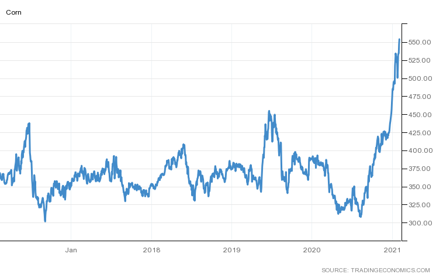

# Kesimpulan

PT BISI International Tbk. merupakan multinational science-based company yang memproduksi produk-produk pertanian yang dimiliki oleh Keluarga Jiaravanon lewat beberapa perusahaan dalam dan luar negeri. BISI memiliki jajaran direksi dan komisaris yang ahli dan berpengalaman di bidangnya. Perseroan konsisten melakukan pengembangan berkala dalam produknya, ditandai dengan anggaran untuk research & development yang tinggi dan banyaknya periset yang bekerja di BISI dan kolaborasi dengan institusi dalam dan luar negeri.

Keuangan perusahaan menunjukkan kinerja yang sangat baik selama 5 tahun terakhir, perusahaan selalu berhasil untuk mencetak peningkatan pendapatan dari tahun 2015 hingga tahun 2018. Terjadi penurunan di tahun 2019 dikarenakan anomali iklim yang menyebabkan biaya produksi meningkat. Hal ini masih dapat dikatakan wajar dikarenakan kinerja perseroan sangat dipengaruhi oleh iklim. Selain itu, perusahaan memiliki neraca yang kuat dengan hutang yang sangat kecil. Dari laporan arus kas perusahaan pada tahun 2019, perseroan menambah hutang jangka pendek namun mampu melunasinya juga pada periode yang sama.

Berdasarkan perhitungan valuasinya, kami menetapkan bahwa nilai harga wajar perusahaan berada di kisaran Rp1.300 hingga Rp1.600. Harga saham BISI untuk saat ini akan sangat menarik untuk dikoleksi karena harga saham saat ini  (Rp1.130 pada tanggal 1 Februari 2021) karena masih berada di bawah nilai wajarnya.

BISI memiliki prospek yang sangat baik untuk tahun-tahun mendatang. Hal ini ditandai dengan adanya anggaran ketahanan pangan yang meningkat, peningkatan pertumbuhan penduduk dari tahun ke tahun yang menyebabkan kebutuhan pangan meningkat, dan tingkat konsumsi pangan (khususnya padi dan jagung) dunia dan Indonesia yang diprediksi akan meningkat untuk tahun mendatang.

Jeremy Owen : https://www.linkedin.com/in/jeremy-owen-/

Thanks to Jesse Gardner (@plasticmind) for the amazing photo!